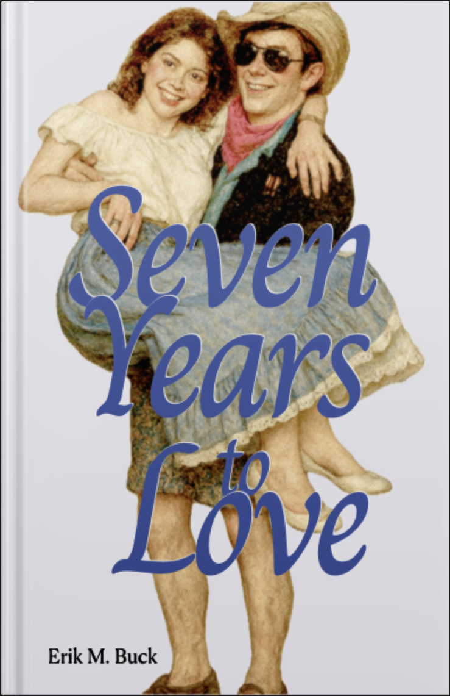

# Prologue

It’s time to give the world a young man’s *inner experience* of finding love. Young men need guides to make sense of the world and their places in it. I benefitted from several guides, all young women. Without them, I could not be me. This story is informed by my lived experience and takes place over the span of a bit more than seven years starting in fall 1983, a period like no other.

**This is a work of fiction:** *Names, characters, places, and incidents are fictitious. Any resemblance to actual events or locales or persons, living or dead, is entirely coincidental.*

<table>
  <tbody>
    <tr>
      <td></td>
      <td><b>Cautions:</b> This story includes blunt candor about sensitive subjects pertinent to the emotions and intimate thoughts of a late adolescent and that young man's self discovery. Teen sexuality is a theme throughout. The story begins with an almost 15 year old boy and follows seven years of emotional growth, heartbreak, first love, and forever love. Subjects include the following: <ul>
        <li>The gamut of emotions: embarrassment, jealousy, body image concerns, self confidence, lust, fear, creativity, compassion, nurturing, and love</li>
        <li>Burgeoning sexuality including fantasies, masturbation, sexual experiences from chaste touch to first intercourse, and angst</li>
        <li>Depression following a break-up</li><li>Brief dialog about self-harm</li>
        <li>Brief dialog about suicidal ideation and suicides that took place decades prior to the story</li>
        <li>Brief dialog about abortion, but no abortions take place</li>
        <li>Scenes involving alcohol use</li>
        <li>Characters engage in a wide spectrum of young adult social and sexual behaviors</li>
      </ul>
      </td>
    </tr>
</tbody>
</table>

## Description
Everret is an almost fifteen year old who has contracted a raging plague of puppy-lust. Everret’s life’s goal is learning how to please a woman. He desires, dates, and disappoints several young women as he matures over seven years. Follow Everrett’s inner thoughts, feelings, fantasies, emotions, anxieties, self discoveries, and sexual escapades both alone and with with the alluring potential to someday “go all the way”. This story chronicles turning points in Everrett’s life, decisions that change his destiny. Everret’s relationships guide him toward a true love he can hardly imagine. It’s a treaturous voyage of self discovery filled with whirlpools of self doubt, shoals of unjustified confidence, and guiding currents of compassion and tolerence. Everrett is cringy, inept, precocious in some ways, and obtuse in other ways. He is sincere, nurturing, apreciative, sometimes callous, and often clueless. Young women in Everrett’s life demonstrate sensuality, integrity, and most importantly to him, how to please a woman. Only then is he ready and worthy to meet his match. Only then can he achive his life’s goal and find his forever.      

## Author Bio & Disclaimer

Erik M. Buck is a semi-retired Engineer, Professor, Manager, Artist, and Entrepreneur. He lives in a midwestern USA state with his wife of 35+ years and is immensely proud of his three adult children. Writing "Seven Years To Love" started as an intimate nostalgic memoire that morphed into a fictional story caputuring the raw emotions of the memoire while protecting the privacy of people in the Author's life. In other words, the emotional context is an authentic subjective representation of the Author's inner experiences but must not be construed as acurate documentation of actual events or real people. Furthermore, the narator is unreliable in the sense that the young man portraied seldom understands events around him.
